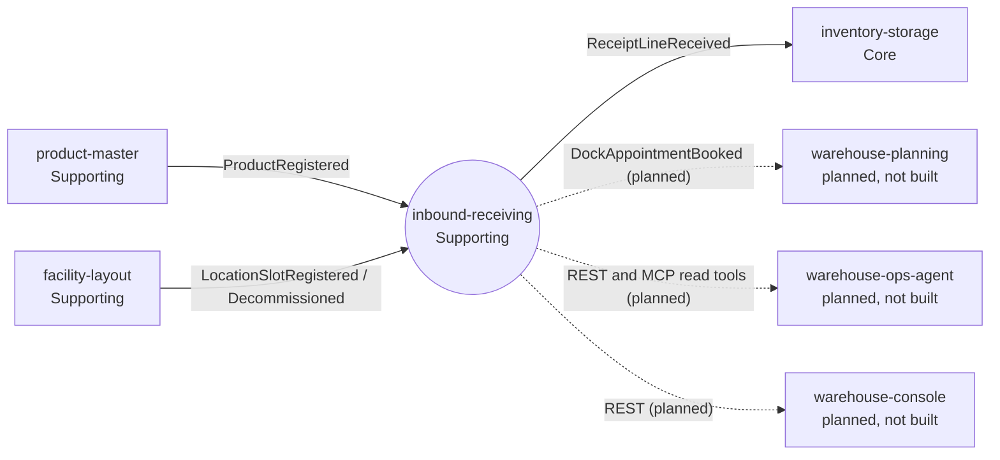

# Bounded context

## Purpose

`inbound-receiving` owns the inbound dock workflow: a supplier announces a
delivery (ASN), a carrier books a door window for it (dock appointment), and
dock staff count what actually arrives (receipt). When a receipt closes it
reports every difference against the announcement. Each counted line is
published once, as a CloudEvent, so `inventory-storage` can book the Good units
as staged stock without this service ever calling it.

Before this context existed there was nothing between "a truck is announced"
and "units are staged in `inventory-storage`": its `POST /stock/receive` is a
bare quantity acknowledgement that does not know which delivery the units
belong to, whether the delivery was announced, who booked which door, or what
was short, over or damaged. [ADR 0001](/docs/adr/0001-inbound-receiving-bounded-context)
puts that announce, appoint, receive, reconcile chain in its own context
because a transactional document workflow changes for different reasons and at a
different cadence than the stock ledger.

## Context map

Source: `docs/adr/0001-inbound-receiving-bounded-context.md` (Context map),
`docs/adr/0003-local-copies-and-handover.md`,
`internal/adapters/inbound/kafka/{product_consumer,dock_door_consumer}.go`,
`internal/adapters/outbound/kafka/encoder.go`; on the consumer side
inventory-storage `internal/adapters/inbound/kafka/inbound_receipt_consumer.go`
and its ADR 0037 (on `develop`).
Omits: the Kafka broker and the patterns on each edge (see the
[context map](/docs/ddd/context-map) for those). Dotted edges are **planned,
not built**: nothing in this repository or in the named sibling depends on
them today.

## No live cross-context lookup, in either direction

- `inbound-receiving` never calls a sibling context at request time. It has no
  outbound HTTP client: the only outbound adapters are Postgres, the Kafka
  relay sink, the clock and the id generator. "Does this SKU exist" and "is
  this an inbound dock door" are answered from local copies (`known_skus`,
  `dock_doors`) fed by events ([ADR 0003](/docs/adr/0003-local-copies-and-handover)).
- No context calls `inbound-receiving` at request time either; the `GET`
  endpoints exist for operators, a future console and agents.

## Local copies fail open by default

`PRODUCT_MODE` and `DOCK_DOOR_MODE` default to `permissive`: the copy is not
consulted and every SKU and every door code is accepted. A typo SKU is
therefore accepted on an ASN until the cluster flips the mode to `kafka` once
the copies have replayed. That is a deliberate fail-open (ADR 0001,
Consequences). In `kafka` mode an unknown SKU is `422 unknown-sku` and an
unknown door `422 unknown-dock-door`.

## Out of scope

Yard and trailer management (an appointment ends at the door), returns,
putaway directives (stow stays an RF action in `inventory-storage`), quality
inspection and quarantine (Damaged units are recorded on the receipt and not
booked as stock), supplier master data, purchase orders and EDI parsing.
