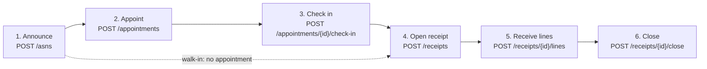

# Receiving workflow

The dock workflow in four steps. Each step is a REST call; the events are
written to the transactional outbox in the same transaction as the change and
published by the relay.

Source: `internal/adapters/inbound/http/server.go` (routes),
`internal/application/usecases/{asn,appointment,receipt}.go`.
Omits: cancel paths and the read endpoints.

| Step | Use case | State change | Event |
| --- | --- | --- | --- |
| Announce | `RegisterAsn` | ASN `Registered` | `ASNRegistered` |
| Appoint | `BookAppointment` | appointment `Booked` | `DockAppointmentBooked` |
| Check in | `CheckInAppointment` | appointment `CheckedIn` | `DockAppointmentCheckedIn` |
| Open | `OpenReceipt` | receipt `Open`, ASN `Registered -> Receiving` | `ReceiptOpened` (the ASN transition raises none) |
| Receive | `ReceiveLine` | line counters grow | `ReceiptLineReceived` per call |
| Close | `CloseReceipt` | receipt `Closed`, ASN `Closed`, appointment `Completed` | `ReceiptClosed`, and `DockAppointmentCompleted` when the receipt came from an appointment |

## Rules worth knowing

- **Appointment is optional.** A receipt may be opened without `appointmentId`
  (a walk-in delivery, no door). With one, the appointment must be `CheckedIn`
  (`409 appointment-not-checked-in`) and cover the ASN (`422
  asn-not-on-appointment`); the receipt takes its door code from it.
- **One open receipt per ASN.** A second `POST /receipts` for the same ASN is
  `409 receipt-already-open`. After a receipt closes the ASN is `Closed`, which
  is not receivable.
- **Receiving lines is not naturally idempotent**, so the `Idempotency-Key` is
  required: a retry with the same key never counts the units twice.
- **Cancel** is only possible while nothing started: an ASN from `Registered`
  (from `Receiving` it is `409 asn-in-progress`) and an appointment from
  `Booked`.
- **Handover.** Every `ReceiptLineReceived` is the handover event.
  `inventory-storage` books `condition=Good` quantities as staged stock;
  `Damaged` units are recorded on the receipt and in its discrepancies but are
  not booked ([ADR 0003](/docs/adr/0003-local-copies-and-handover)).

## Concurrency and replays

- Every mutable resource has a `version` that is also its strong `ETag`.
  Action `POST`s may send `If-Match`; a stale value is `412 version-mismatch`,
  and a write that loses a race in the database is `409 concurrent-modification`.
- Resource-creating `POST`s (`/asns`, `/appointments`, `/receipts`,
  `/receipts/{id}/lines`) require `Idempotency-Key`; the action `POST`s
  (`cancel`, `check-in`, `close`) accept it but do not require it, since the
  state machine already refuses a repeat with `409`.
